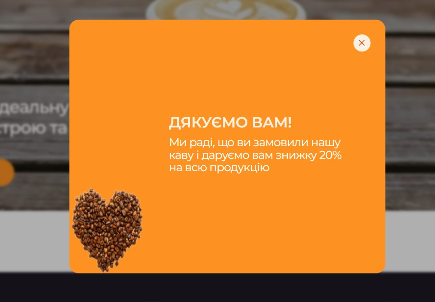

# Coffee- project Тестове завдання

## Технології, використані в проекті
HTML 5, CSS 3 – верстка контенту, 
JavaScript – програмування інтерактивних елементів додатку.
Vite - сучасний інструмент збірки (build tool) і сервер розробки (development server).

## Адаптивність
Верстка виконана для наступних присторїв з шириною екрана
* смартфони - від 375 px
* TAB - від 768 px
* PC - від 1200 px

## Особливості проекту
Проект: односторінковий сайт для рекламного представлення продажу кави.
Структура сторінки має наступні секції: 
-	Головна
-	Переваги
-	Як це зроблено
-	Каталог
-	Чому ми?
-	Відгуки
-	Call to action для підписників
-	Контакти

Загалом наповнення даних розділів повністю відповідає вимогам технічного завдання.

Секція `«Переваги»` розділена на 2 блоки. Другий блок реалізований у вигляді 3D слайдера.

Секція `«Як це зроблено»` демонструє відео з професійного приготування різних видів кави.

Секція `«Наш каталог»`. Картки товарів , 8 шт реалізовані у вигляді слайдера для цілей дизайну і можуть бути реалізовані в будь-якій компоновці.

Секція `«Відгуки»` реалізована у вигляді слайдера з картками – 6 шт. Можуть бути добавлені в будь-якій розумній кількості.

`Футер` містить контакти. При натисненні на вказаний номер телефону на екрані смартфону, останній  робить виклик за даним номером. При натисненні на вказану адресу ел пошти, відкривається поштовий клієнт, наявний на смартфоні користувача. 

`Іконки` з посиланнями на соцмережі. Використано 2 шт для цілей дизайну. Можуть бути будь - якими.

`Блок з розділами сторінки`. При кліку відбувається перехід до відповідної секції сторінки. Реалізовано в хедері і в футері сторінки. Плавність прокрутки забезпечується за допомогою JavaScript. Для версій Smart і Tab даний блок реалізований в бургер меню.

`Модальні вікна`. При натисненні на відповідні кнопки, відкривається модальне вікно. Валідацію введених даних реалізовано у всіх полях крім поля «Коментар». При введенні неповних або некоректних даних відправка не відбувається про що користувач отримує сповіщення і відповідних полях модального вікна.

Після введення коректних даних і відправки їх, відкривається додаткове модальне вікно. 

## Підготовка до роботи

1. Переконайся, що на комп'ютері встановлено LTS-версію Node.js.
   [Скачай та встанови](https://nodejs.org/en/) її якщо необхідно.
2. Склонуй цей репозиторій на локальний PC `git clone https://github.com/MaksymChukhrai/coffee-project.git .`
2. Встанови базові залежності проекту в терміналі командою `npm install`.
3. Запусти режим розробки, виконавши в терміналі команду `npm run dev`.
4. Перейдіть у браузері за адресою
   [http://localhost:5173](http://localhost:5173). Ця сторінка буде автоматично
   перезавантажуватись після збереження змін у файли проекту.

